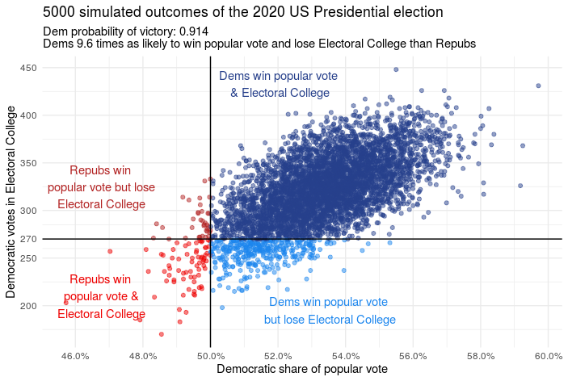

# Electoral College Forecast
Forecast the 2020 US presidential election outcome based on individual state betting markets from PredictIt. Makes use of Daniel Kovtun's [rpredictit wrapper](https://github.com/danielkovtun/rpredictit). 

Current electoral college vote counts per [270 to Win](https://www.270towin.com/).

State and district-level population estimates are from Wikipedia as of 2019.

Results are sensitive to
* 'probSD': estimated standard deviation of polling forecasts derived from betting market win probabilities. Current value of .08 plugged to get reasonably close to current state polling numbers
* 'pollingSD': given expected state-level mean polling figures derived above, estimate the standard deviation around that estimate to simulate 100,000 ('nTrials') elections

